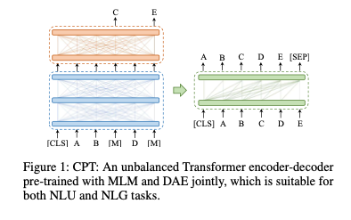

+++
title = "基于Amazon SageMaker的BERT-SEQ2SEQ模型训练动手实验"
weight = 3
chapter = true
pre = "<b>3. </b>"
+++

## 模型架构

## 模型输入输出范例
* 输入：嘉实基金推出旗下第3只成长基金——嘉实领先成长股票型基金，目前该基金已获得证监会批复，将于近期正式发行。据悉，嘉实领先成长基金股票资产占基金资产的60%～95%，其中不低于80%的比例投资于领先成长企业。嘉实领先成长基金具有鲜明的“全市场成长风格”，其重点投资于中国经济中快速成长行业中的领先成长企业，力争获得双重超额收益。嘉实基金认为，伴随中国经济的深入调整，未来成长行业也将呈现鱼目混杂现象。需要通过在全市场范围中精选快速成长行业中成长战略清晰的领先成长企业，才有望获取丰厚的投资收益。据悉，嘉实领先成长基金将由嘉实策略增长的基金经理之一邵秋涛执掌
* 输出： 嘉 实 领 先 成 长 基 金 获 批

## 预训练介绍
基于bert的seq2seq是一个经典的生成式摘要方法，需要大量的预训练，适合于自动的段标题（短摘要生成）场景。本实验中，会附上训练的相关代码供参考，但不涉及模型训练部分，仅实验模型部署及使用。
本实验提供的预训练模型是基于`中文数据集THUCNews`，在`ml.p3.16xlarge`上进行训练3天得到。

THUCNews是根据新浪新闻RSS订阅频道2005~2011年间的历史数据筛选过滤生成，包含74万篇新闻文档（2.19 GB），均为UTF-8纯文本格式。我们在原始新浪新闻分类体系的基础上，重新整合划分出14个候选分类类别：财经、彩票、房产、股票、家居、教育、科技、社会、时尚、时政、体育、星座、游戏、娱乐。
每个新闻均为txt文件，第一句话为新闻摘要。